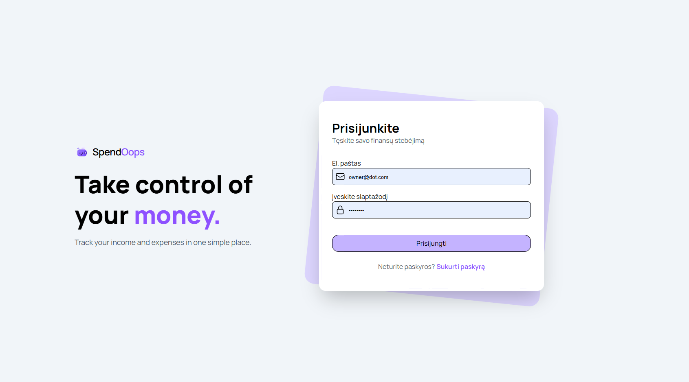
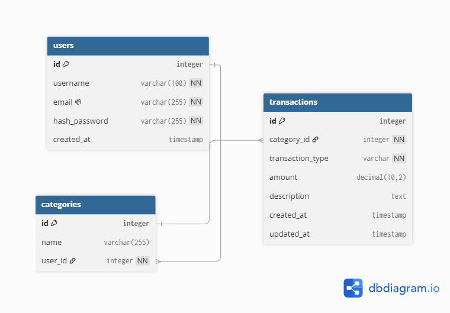

<p align="center">
  
</p>

# SpendOops

SpendOops is a personal finance tracker built with vanilla PHP, MySQL and PDO.

## Screenshot



## Features

- User registration and login
- Secure password hashing with `password_hash()` and `password_verify()`
- User-specific income and expense tracking
- User-specific transaction categories
- Add, view and delete transactions
- CSRF protection
- Responsive UI built with Tailwind CSS
- PDO prepared statements for database queries

## Tech Stack

- PHP
- MySQL
- PDO
- JavaScript
- HTML
- Tailwind CSS

## Database Schema



The application uses a database with three main tables:

- `users`
- `categories`
- `transactions`

### Users

The `Users` table stores information about registered users.

Each user has their own account and can create and manage their personal transactions.

## Categories

The `Categories` table stores transaction categories, such as:

- Food
- Transport
- Entertainment
- Bills

  Categories are used to organize transactions and make expenses easier to track.

### Transactions

The `Transactions` table stores user's financial transactions.

Each transaction contains information such as:

- transaction type
- amount
- description
- category

Transactions are associated with a user through their category.

## Table Relationships

- One `user` can have many `categories`.
- One `category` belongs to one `user`.
- One `category` can have many `transactions`.
- One `transaction` belongs to one `category`.
- A `transaction` is associated with a `user` through its `category`.

This structure allows each user to track and categorize their expenses independently.

## Setup

1. Clone this repository
2. Install PHP dependencies if required:
3. Install frontend dependencies:

```bash
npm install
```

4. Create a MySQL database.
5. Import:

```bash
database/schema.sql
```

6. Copy the database configuration example:

```bash
cp config/database.example.php config/database.php
```

7. Update the database credentials in:

```bash
config/database.php
```

8. Build Tailwind CSS:

```bash
npx @tailwindcss/cli -i ./src/css/input.css -o ./public/css/output.css
```

9. Start the PHP development server:

```bash
php -S localhost:8000 -t public
```

10. Open the application in your browser:
    http://localhost:8000
